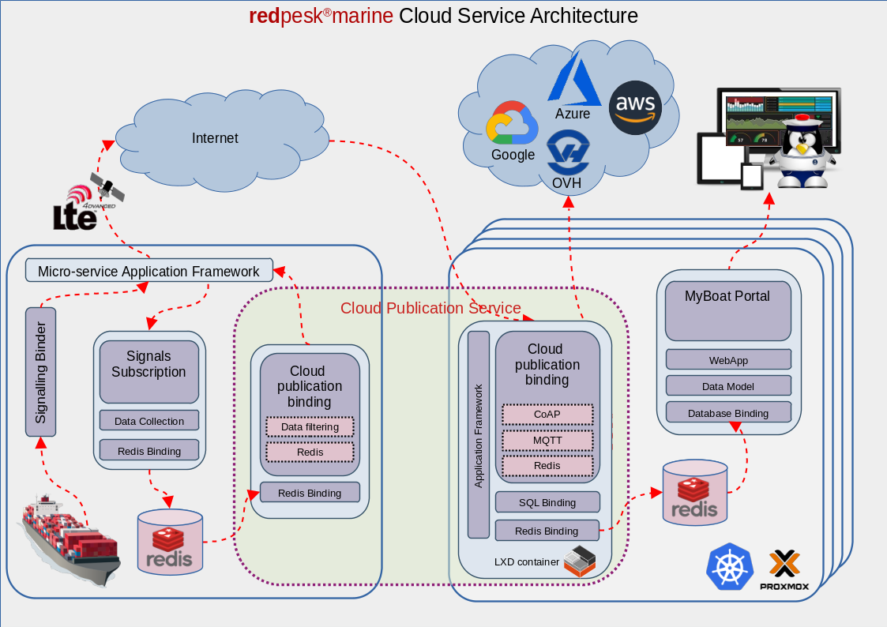

# redpesk® Cloud Publication Binding

## 1. Introduction

The cloud publication binding allows to selectively publish target signal data
to the cloud with proper link quality handling. When the cloud side disconnects,
the binding running on the target will pend and resume publication when the link
is up again.

## 2. Architecture

The cloud publication binding relies on redis-tsdb-binding on both the cloud and
target sides. It reads from the target Redis database using redis-tsdb-binding
and writes to the cloud side also using the redis-tsdb binding, this time
running in the cloud

